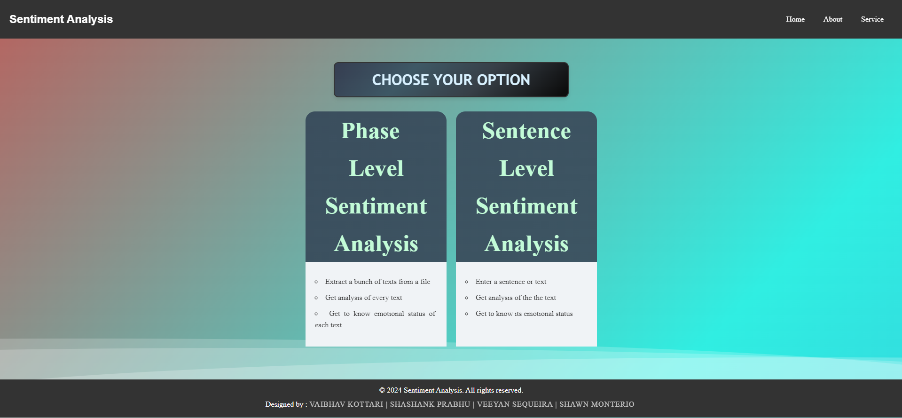
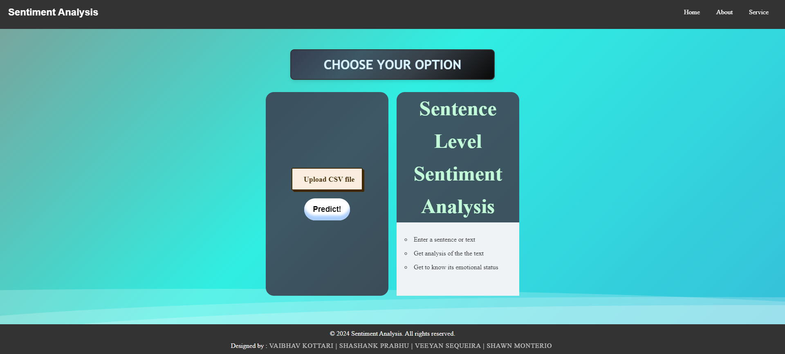
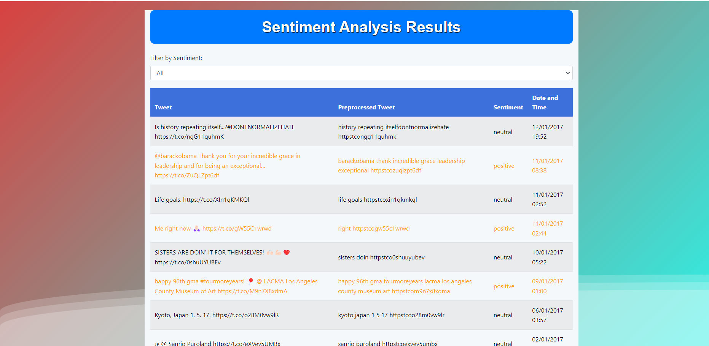
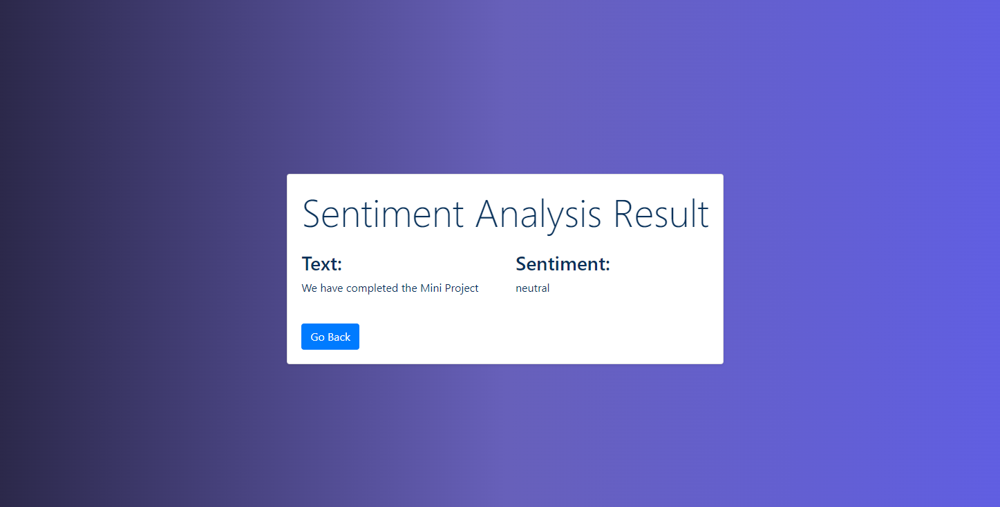

# Sentiment Analysis Web App

## Overview
This project is a web application for sentiment analysis. It allows users to input text and receive a sentiment analysis score indicating whether the sentiment is positive, negative, or neutral.

## Project Images

*Figure 1:Shows the web add interface .*

*Figure 2: You can either add a CSV file or add a single line text to check its sentiment.*

*Figure 3: Result of sentiment analysis of CSV file .*

*Figure 4: Result of sentiment analysis of Text input.*

## Features
- **User Input**: Users can input text directly into the web app.
- **Sentiment Analysis**: The app processes the input text and returns a sentiment score.
- **Real-time Results**: The sentiment analysis is performed in real-time, providing immediate feedback.

## Technologies Used
- **Frontend**: HTML, CSS, JavaScript
- **Backend**: Python, Flask
- **Machine Learning**: Scikit-learn, NLTK
- **Deployment**: Render
